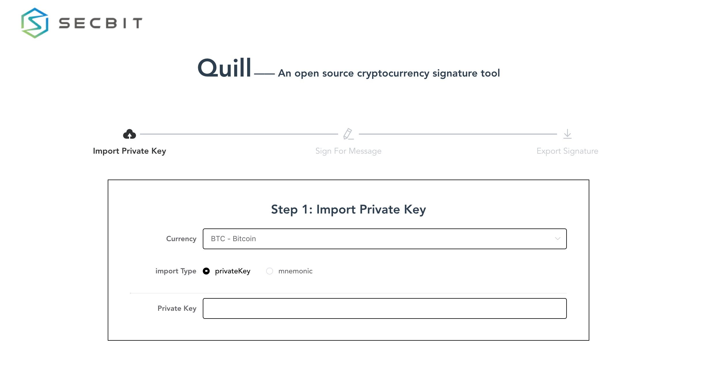

# quill

An open source cryptocurrency signature tool

 <a href="https://github.com/vuejs/vue">
    
  </a>
  <a href="https://github.com/ElemeFE/element">
    
  </a>
  <a href="https://github.com/tuandm/laravue/blob/master/LICENSE">
    
  </a>

## Preview



## Features

* Import type: private key, mnemonic

* Export type: json, csv and excel 

* supported cryptocurrencies
 
    1. BCH - Bitcoin Cash

    2. BTC - Bitcoin

    3. BTC - Bitcoin Testnet

    4. BTG - Bitcoin Gold

    5. ETC - Ethereum Classic

    6. ETH - Ethereum

    7. LTC - Litecoin

    8. XRP - Ripple


## Build Setup

``` bash
# install dependencies
npm install

# serve with hot reload at localhost:8080
npm run dev

# build for production with minification
npm run build
```

## Lience

[MIT License](http://en.wikipedia.org/wiki/MIT_License)